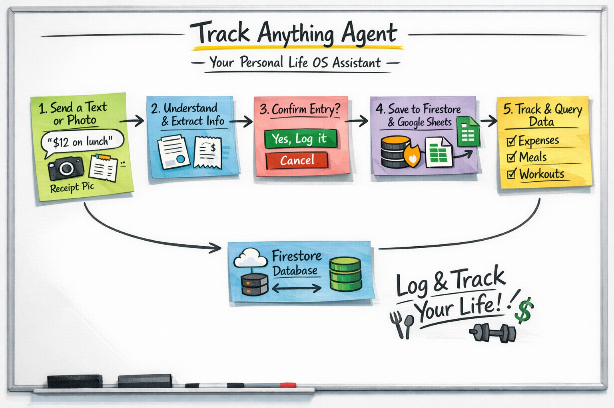

# Track Anything Agent

A personal Life OS assistant — a Telegram bot backed by an agentic, multi-modal AI pipeline that lets you log, track, and query anything from your daily life using natural language or photos.

> Send a text message or snap a photo of a receipt. The agent understands, proposes what to log, asks for your confirmation, then writes to Firestore and syncs to Google Sheets — all without touching a spreadsheet.

---

## What it does

- **Natural language logging** — "I spent $12 on lunch today" creates a structured entry in the right tracker.
- **Image understanding** — Send a photo of a receipt, invoice, or food label. A vision model extracts the data and the agent proposes the log entry.
- **Human-in-the-Loop confirmation** — Before any write, the agent presents an inline Telegram button ("Yes, log it" / "Cancel"). Nothing is written without your approval.
- **Firestore-first persistence** — All writes go to Firestore first, then sync to Google Sheets asynchronously in the background.
- **Extensible tracker system** — Trackers (Expenses, Meals, Workouts, etc.) are defined dynamically. Adding a new one is a single user message away.

---

## Architecture

```
Telegram (user interface)
    │
    ▼
FastAPI  (webhook receiver)
    │
    ▼
LangGraph Orchestrator  (stateful workflow graph)
    ├── parse_intent node   →  LiteLLM  →  Gemini 2.5 Flash (or any model)
    ├── [HITL checkpoint]   →  pauses graph, sends inline keyboard to user
    └── execute_tool node   →  Tool Registry  →  Firestore / Sheets / Vision
```

### Key design decisions

| Concern | Solution | Why |
|---|---|---|
| Workflow | LangGraph | Stateful, resumable graph — the HITL pause-and-resume pattern requires persistent graph state across two separate HTTP requests |
| LLM calls | LiteLLM | Single interface for Gemini, Claude, GPT, etc. Swap models by changing one string |
| Tool dispatch | Custom Tool Registry | Decorator-based registration; adding a new capability is one file and one decorator |
| State persistence | Firestore Checkpointer | LangGraph threads survive process restarts; Firestore is already in the stack |
| Config | pydantic-settings | Strict env-var loading, no hardcoded fallbacks, IDE-friendly |
| Interface | python-telegram-bot (async) | Webhook mode; inline keyboards for HITL interaction |
| Deployment | Docker + Cloud Run | Stateless container, scales to zero |

---

## Project structure

```
track-anything-agent/
├── src/
│   ├── main.py                       # FastAPI entry point (lifespan, webhook endpoint)
│   ├── agent/
│   │   ├── orchestrator.py           # LangGraph graph definition + run/resume functions
│   │   ├── registry.py               # Tool registry (decorator-based, LiteLLM schema export)
│   │   └── prompts.py                # System prompt + vision prompt
│   ├── tools/
│   │   ├── sheets_tool.py            # Google Sheets read/write (async)
│   │   ├── firestore_tool.py         # Firestore CRUD + sync flag management
│   │   └── vision_tool.py            # Image analysis via Gemini Vision
│   ├── integrations/
│   │   ├── telegram.py               # Bot handlers: text, photo, inline callback
│   │   └── mcp_server.py             # MCP wrapper exposing tools to external clients
│   └── utils/
│       ├── config.py                 # pydantic-settings env config
│       ├── logger.py                 # Structured logging
│       └── firestore_checkpointer.py # LangGraph checkpointer backed by Firestore
├── tests/
├── Dockerfile
├── requirements.txt
└── .env.example
```

---

## User flow

```
User sends: "spent $4.50 on coffee"
    │
    ▼
LLM parses intent → calls add_log(tracker="Expenses", values=["2026-03-06", "Coffee", "$4.50"])
    │
    ▼
Graph pauses at HITL checkpoint
    │
    ▼
Bot sends: "I want to log to Expenses: [date, Coffee, $4.50]. Shall I proceed?"
           [Yes, log it]  [Cancel]
    │
    ▼  (user clicks Yes)
Graph resumes → Firestore write → background sync to Google Sheets
    │
    ▼
Bot replies: "Logged! Coffee - $4.50 added to Expenses."
```

For **photo messages**, the vision model runs first and its structured description is fed into the same orchestrator flow.

---

## Tech stack

- **Python 3.12**
- **FastAPI** + **uvicorn** — async webhook server
- **LangGraph** — stateful agentic workflow with HITL checkpoint
- **LiteLLM** — model-agnostic LLM interface (default: `gemini/gemini-2.5-flash`)
- **python-telegram-bot** — async Telegram bot with inline keyboards
- **Google Cloud Firestore** — primary data store and LangGraph checkpointer
- **Google Sheets API** — secondary sync target
- **pydantic-settings** — environment configuration
- **Docker** — containerised for Cloud Run deployment

---

## Environment variables

```bash
GOOGLE_CLOUD_PROJECT=your-gcp-project-id
GEMINI_API_KEY=your-gemini-api-key
SPREADSHEET_ID=your-google-sheets-id
TELEGRAM_BOT_TOKEN=your-telegram-bot-token
```

Copy `.env.example` to `.env` and fill in the values.

---

## Running locally

```bash
# Install dependencies
pip install -r requirements.txt

# Webhook mode (requires a public URL, e.g. via ngrok)
python src/main.py

# Polling mode (no public URL needed — good for local dev)
python run_polling.py
```

---

## Deployment

```bash
docker build -t track-anything-agent .
docker run --env-file .env -p 8080:8080 track-anything-agent
```

For Cloud Run, set the environment variables as secrets and point Telegram's webhook to the deployed service URL.
