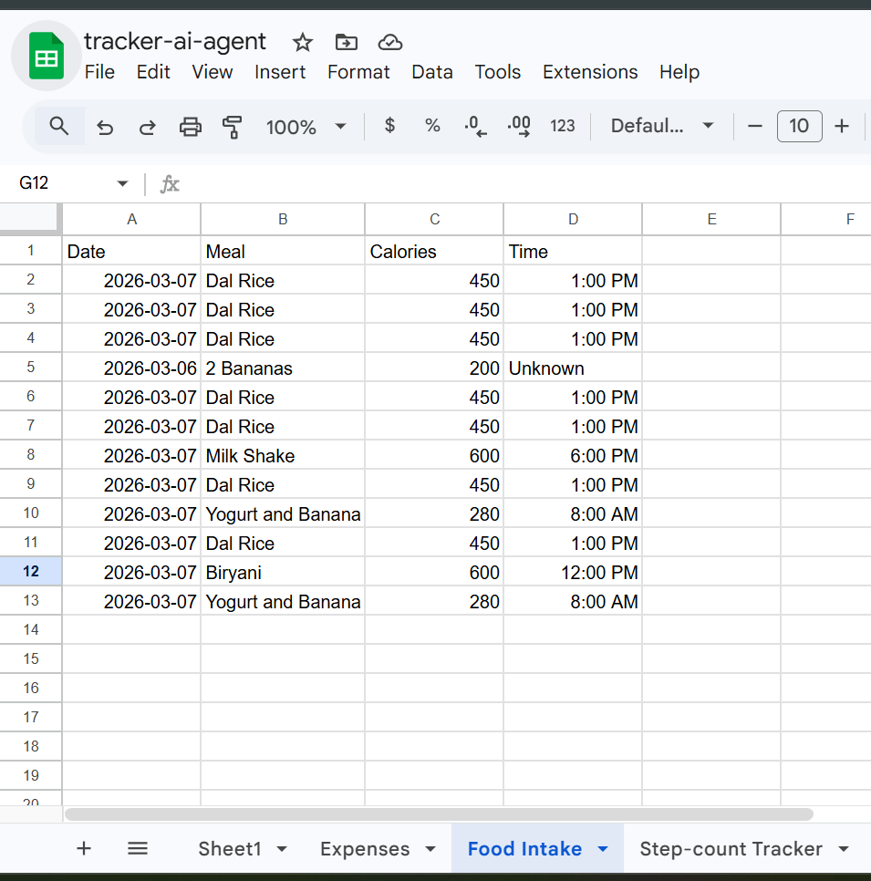

# Trackbot Agent

> **The bridge between your messy daily life and your structured Life OS.**

A personal AI assistant on Telegram that turns the chaos of daily life — receipts, meals, workouts, spending — into a clean, queryable system. Talk to it in plain language or send a photo. It handles the structure.


---

## The three pillars

```
Input (Capture)         Processing (Logic)          Output (Reflection)
─────────────────       ──────────────────────       ────────────────────
You send a text or      LangGraph agent understands  Data lives in Firestore,
photo to Trackbot       intent, maps it to the       synced to Google Sheets
on Telegram.            right tracker + fields,      for dashboards, trends,
                        and writes it — no form,     and daily review.
                        no app, no friction.
```

The idea: capture should be zero-friction (a Telegram message), logic should be invisible (the agent), and reflection should be effortless (a spreadsheet you didn't have to maintain).

---

## What Trackbot does

- **Natural language logging** — "I spent $12 on lunch today" creates a structured entry in the right tracker, with correct field mapping.
- **Image understanding** — Send a photo of a receipt, invoice, or food label. A vision model extracts the data and Trackbot proposes the log entry.
- **Selective Human-in-the-Loop** — Only tracker *creation* pauses for your confirmation (inline Telegram buttons). Logging and querying execute instantly.
- **Firestore-first persistence** — All writes go to Firestore first, then sync to Google Sheets asynchronously in the background.
- **Extensible tracker system** — Trackers (Expenses, Meals, Workouts, Sleep, etc.) are defined dynamically. Creating a new one is a single message.
- **Contextual memory** — Trackbot remembers which tracker you last used and defaults to it, so you never have to repeat yourself.
- **Session persistence** — Conversation history and active tracker context survive across sessions, stored in Firestore per chat.

---
## Google sheet output:


## Architecture

```
Telegram (you talk to Trackbot here)
    │
    ▼
FastAPI  (webhook receiver on Cloud Run)
    │
    ▼
LangGraph Orchestrator  (stateful workflow graph)
    ├── parse_intent node   →  LiteLLM  →  Gemini 2.5 Flash (Vertex AI)
    ├── [HITL checkpoint]   →  pauses graph, sends inline keyboard to Telegram
    └── execute_tool node   →  Tool Registry  →  Firestore / Sheets / Vision
```

### Key design decisions

| Concern | Solution | Why |
|---|---|---|
| Workflow | LangGraph | Stateful, resumable graph — the HITL pause-and-resume pattern requires persistent graph state across two separate HTTP requests |
| LLM calls | LiteLLM + fallback chain | Single interface for Gemini on Vertex AI. On 429/503/400, automatically retries: `gemini-2.0-flash` → `gemini-2.5-flash` → `gemini-2.5-pro` |
| Tool dispatch | Custom Tool Registry | Decorator-based registration; adding a new capability is one file and one decorator |
| State persistence | Firestore Checkpointer | LangGraph threads survive process restarts; Firestore is already in the stack |
| Session memory | Firestore `agent_sessions/{chat_id}` | `conversation_history` and `last_active_tracker` persisted per Telegram chat after every turn |
| Memory architecture | Three-layer context system | Short-term history (6 turns) + rolling summary (`state_summary`) + sticky active tracker |
| Prompt engineering | Pyramid structure + dynamic injection | Trackers filtered per-request; truth assertion placed immediately after tracker list |
| Config | pydantic-settings | Strict env-var loading, no hardcoded fallbacks, IDE-friendly |
| Interface | python-telegram-bot (async) | Webhook mode; inline keyboards for HITL interaction |
| Deployment | Docker + Cloud Run (us-central1) | Stateless container, scales to zero, no local Docker needed — Cloud Build handles image builds |
| Auth | Workload Identity (SA binding) | Cloud Run runs *as* the service account — no JSON key file in the container, pure ADC via metadata server |

---

## Project structure

```
trackbot-agent/
├── src/
│   ├── main.py                       # FastAPI entry point (lifespan, webhook endpoint)
│   ├── agent/
│   │   ├── orchestrator.py           # LangGraph graph definition + run/resume functions
│   │   ├── registry.py               # Tool registry (decorator-based, LiteLLM schema export)
│   │   └── prompts.py                # System prompt + vision prompt
│   ├── tools/
│   │   ├── sheets_tool.py            # Google Sheets read/write (async)
│   │   ├── firestore_tool.py         # Firestore CRUD + session persistence + sync flag management
│   │   └── vision_tool.py            # Image analysis via Gemini Vision
│   ├── integrations/
│   │   ├── telegram.py               # Bot handlers: text, photo, inline callback
│   │   └── mcp_server.py             # MCP wrapper exposing tools to external clients
│   └── utils/
│       ├── config.py                 # pydantic-settings env config
│       ├── logger.py                 # Structured logging
│       └── firestore_checkpointer.py # LangGraph checkpointer backed by Firestore
├── tests/
├── Dockerfile
├── requirements.txt
└── .env.example
```

---

## How memory and context work

The agent manages context across turns using three cooperating layers:

**Layer 1 — Recent conversation history**
The last 6 message pairs (user + assistant) are passed to the LLM on every turn. This window is intentionally small — old turns flow into the summary layer rather than bloating the context window indefinitely. The history lets the LLM resolve references like "add it", "show that", "the one I just mentioned".

**Layer 2 — Rolling conversation summary**
When `conversation_history` exceeds 10 messages, the agent automatically condenses the older portion into a `state_summary` string via a lightweight LLM call. This summary is injected into the system prompt as a `CONVERSATION SUMMARY` block. The result: context from earlier in the session is retained without ever growing the raw message list beyond 6 pairs.

**Layer 3 — Sticky active tracker**
`AgentState` carries a `last_active_tracker` field. After every tool call that targets a tracker, this field is updated and injected into the system prompt as:

```
ACTIVE CONTEXT: The last tracker used was 'Expenses'. If the user's message
doesn't explicitly name a different tracker, default to 'Expenses'.
```

This means you can say "add 200" right after logging an expense and Trackbot correctly routes it to Expenses — without asking.

**Dynamic tracker injection**
Rather than dumping every tracker into every prompt, `filter_trackers_for_input()` matches the user's message against tracker names, header names, and description keywords. Only relevant trackers are shown. With many trackers this cuts prompt size by 50–80%. The active tracker is always included as a safety anchor, and the fallback is to show all trackers if nothing matches.

**Context blindness correction**
If the LLM previously said "no trackers exist" but trackers have since been created, a `[System Correction]` message is injected just before the current user turn to override the stale belief. This prevents hallucinating an empty state.

**Prompt pyramid structure**
The system prompt is ordered so the most authoritative information comes first:
1. Core identity + today's date
2. Conversation summary (if any)
3. Relevant trackers (filtered, ground-truth labelled)
4. Active context (sticky tracker)
5. Critical truth assertion — immediately after the tracker list
6. Rules

**Context switching** is handled by the LLM using semantic understanding. "How much have I spent total?" after a Food Intake log correctly switches back to Expenses because the question is semantically about spending, not food.

---

## User flow

**Logging (no confirmation needed)**
```
User: "spent $4.50 on coffee"
    │
    ▼
Trackbot infers tracker (Expenses) → calls add_log with correct field mapping
    │
    ▼
Firestore write → background sync to Google Sheets
    │
    ▼
Trackbot: "Logged! Coffee - $4.50 added to Expenses."
```

**Creating a new tracker (confirmation required)**
```
User: "create an Expenses tracker with columns Item, Amount, Category, Notes"
    │
    ▼
LLM calls create_tracker → graph pauses at HITL checkpoint
    │
    ▼
Trackbot sends inline keyboard: "Create tracker 'Expenses'? [Yes, log it] [Cancel]"
    │
    ▼  (user clicks Yes)
Graph resumes → Firestore write → Sheets tab created
    │
    ▼
Trackbot: "Done! Expenses tracker is ready."
```

For **photo messages**, the vision model runs first and its structured description is fed into the same orchestrator flow.

---

## Test results

The agent ships with a 10-scenario automated test suite (`tests/test_agent.py`) that runs end-to-end against live Firestore — no mocks.

**Latest run: 9/10 pass**

| Test | What it checks | Status |
|---|---|---|
| T01 | Query when database is empty | PASS |
| T02 | Create tracker with HITL confirm | PASS |
| T03 | Log expense — auto-detect tracker, correct field order | PASS |
| T04 | Show logs without naming tracker (memory: sticky Expenses) | PASS |
| T05 | Log with natural language date ("this morning") | PASS |
| T06 | Create second tracker with HITL confirm | PASS |
| T07 | Log to new tracker — auto-detect from message content | PASS |
| T08 | Context switch: spending query after food log → back to Expenses | PASS |
| T09 | Ambiguous input ("add 200") — agent asks for clarification | PASS |
| T10 | Decline tracker creation (cancel HITL) | PASS |

To run a clean test:
```bash
python tests/clear_data.py   # wipe Firestore + Sheets
python tests/test_agent.py   # run all 10 scenarios
```

---

## Tech stack

- **Python 3.11**
- **FastAPI** + **uvicorn** — async webhook server
- **LangGraph** — stateful agentic workflow with HITL checkpoint
- **LiteLLM** — model-agnostic LLM interface with Vertex AI fallback chain: `gemini-2.0-flash` → `gemini-2.5-flash` → `gemini-2.5-pro`
- **python-telegram-bot** — async Telegram bot with inline keyboards
- **Google Cloud Firestore** — primary data store, LangGraph checkpointer, and session store
- **Google Sheets API** — secondary sync target (structured output layer)
- **pydantic-settings** — environment configuration
- **Docker + Cloud Build** — containerised, built on GCP with no local Docker required
- **Cloud Run** — serverless deployment, scales to zero

---

## Deployment

### Live service

```
Service: trackbot-agent
Region:  us-central1
URL:     https://trackbot-agent-386733832309.us-central1.run.app
Auth:    Workload Identity — SA bound directly to Cloud Run, no key file
```

### Rebuild and redeploy

```bash
# Build via Cloud Build (no local Docker needed)
gcloud builds submit \
  --tag us-central1-docker.pkg.dev/gen-lang-client-0746536657/trackbot/trackbot-agent:latest

# Redeploy
gcloud run deploy trackbot-agent \
  --image us-central1-docker.pkg.dev/gen-lang-client-0746536657/trackbot/trackbot-agent:latest \
  --region us-central1
```

### Register Telegram webhook

```bash
curl "https://api.telegram.org/bot<TOKEN>/setWebhook?url=https://trackbot-agent-386733832309.us-central1.run.app/webhook"
```

### Secrets (managed via Secret Manager)

| Secret | What it holds |
|---|---|
| `TELEGRAM_BOT_TOKEN` | Telegram bot token |
| `SPREADSHEET_ID` | Google Sheets target |

Non-secret env vars (`GOOGLE_CLOUD_PROJECT`, `VERTEX_LOCATION`) are set directly on the Cloud Run service. No `GOOGLE_APPLICATION_CREDENTIALS` needed — the SA is attached at the service level and all GCP SDKs authenticate via the metadata server.

---

## Known issues and roadmap

### Current gaps

| Issue | Detail | Workaround / Fix |
|---|---|---|
| Filter threshold brittle at exactly 2 trackers | With 2 trackers, filtering is skipped (both always shown). Keyword matching is too literal for semantic synonyms like "spent" → Expenses. | Threshold already raised to `<= 2`; longer-term, use stemming or embed a small synonym table for common domains. |
| T01 slow (18s+) | On an empty database the LLM still gets a full tool-equipped prompt. No tracker exists so the response is direct, but the round-trip is slow. | Route "list trackers" queries through a lightweight check before hitting the LLM. |
| `state_summary` not carried across sessions | `state_summary` is generated inside the graph per-turn but not yet persisted to Firestore alongside `conversation_history`. | Add `state_summary` to `save_session` / `load_session` and extend `orchestrator.run()` to accept it as input. |

### Roadmap

- [ ] Daily Debrief — an evening summary sent automatically: "Today you spent $45, ate 2,200 calories, and finished your workout. Your Life OS is up to date."
- [ ] `update_tracker` tool — add columns, rename headers, with Firestore + Sheets schema migration
- [ ] Duplicate detection in `add_log` — check for identical (tracker, values) within 60 seconds
- [ ] Richer tracker filtering — synonym expansion for spending / food / sleep domains
- [ ] Multi-user support — user isolation in Firestore (currently single-user)
- [ ] Background sync health-check endpoint

---

## Environment variables

For local development, copy `.env.example` to `.env`:

```bash
GOOGLE_CLOUD_PROJECT=your-gcp-project-id
VERTEX_LOCATION=us-central1
GOOGLE_APPLICATION_CREDENTIALS=/path/to/sa-key.json   # local only — not used in Cloud Run
SPREADSHEET_ID=your-google-sheets-id
TELEGRAM_BOT_TOKEN=your-telegram-bot-token
```

On Cloud Run, `TELEGRAM_BOT_TOKEN` and `SPREADSHEET_ID` are mounted from Secret Manager. The service account is bound directly to the Cloud Run service — no key file is used.

The LLM is called via **Vertex AI** (not the Gemini API directly). The service account needs `Vertex AI User` and `Cloud Datastore User` roles as a minimum.

---

## Running locally

```bash
# Install dependencies
pip install -r requirements.txt

# Webhook mode (requires a public URL, e.g. via ngrok)
uvicorn src.main:app --reload --port 8080

# Polling mode (no public URL needed — good for local dev)
python run_polling.py

# Run tests (against live Firestore)
python tests/clear_data.py
python tests/test_agent.py
```
